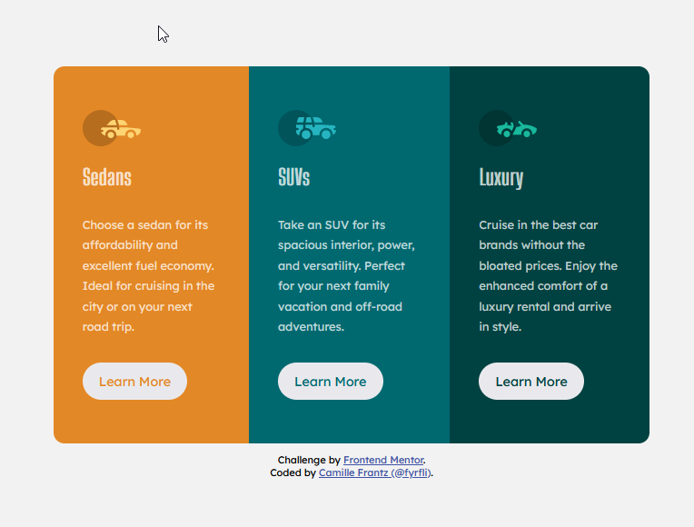

# Frontend Mentor - 3-column preview card component solution

[@fyrfli](https://www.frontendmentor.io/profile/fyrfli)'s second solution to the [3-column preview card component challenge on Frontend Mentor](https://www.frontendmentor.io/challenges/3column-preview-card-component-pH92eAR2-) using LESS for styling. 

## The challenge

Users should be able to:

- View the optimal layout depending on their device's screen size
- See hover states for interactive elements

## Screenshot

## Links

- Solution URL: [Add solution URL here](https://your-solution-url.com)
- Live Site URL: [Add live site URL here](https://your-live-site-url.com)

## My process

I decided to redo this challenge using LESS and timing myself. It took me a lot longer than I wanted it to because there are still some things I need more practice with. The idea is to start using frameworks to help with my coding. Tailwindcss looks fast and easy but ultimately I much prefer LESS because I get to define my own variables and feels more flexible to me at this point. Probably because I need a LOT more practive with Tailwind but for now I am happy just working with LESS.

### Built with

- Semantic HTML5 markup
- LESS/CSS custom properties
- Flexbox
- CSS Grid
- Mobile-first workflow

## Author

- Website - [Camille Frantz (@fyrfli)](https://fyrfli.io)
- Frontend Mentor - [@fyrfli](https://www.frontendmentor.io/profile/fyrfli)
- Twitter - [@fyrfli](https://www.twitter.com/fyrfli)